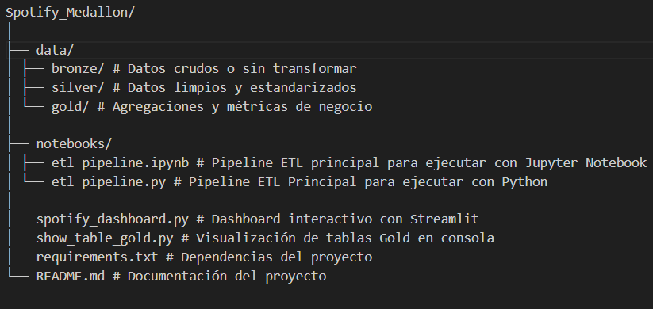
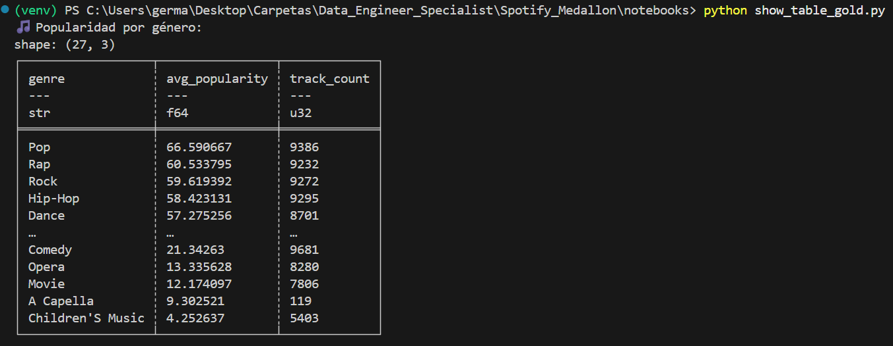
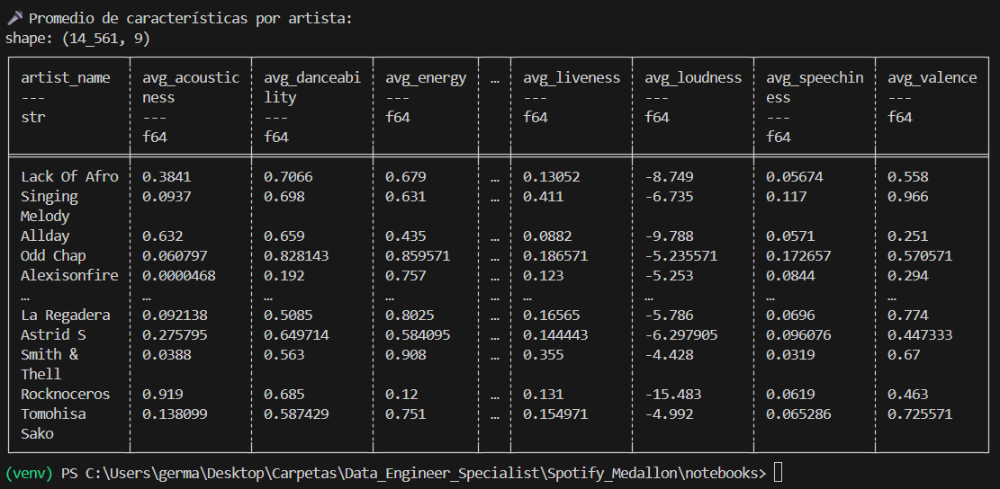

# 🎧 Spotify Medallón - Data Engineering Project

## 🚀 Objetivo del Proyecto

El propósito de este proyecto es construir un **pipeline ETL automatizado** siguiendo una **arquitectura medallón (Bronze → Silver → Gold)** para analizar datos musicales de **Spotify**, mediante las librerías Polars y PyArrow.

Polars es una librería de procesamiento de datos en columnas escrita en Rust y con API para Python, R y Node.js. Está diseñada para trabajar con datasets grandes y operaciones paralelas, aprovechando multithreading y vectorización nativa. Mientras que Pyarrow es una librería de bajo nivel que implementa el formato Apache Arrow, un estándar para representar datos en columnas en memoria (columnar memory format).

En palabras simples: 

- 🧩 Polars → equivalente local a Spark (procesamiento en memoria, tipo DataFrame).
- 📦 PyArrow → equivalente base a Delta/Parquet (manejo de formato columnares, interoperabilidad).

A través de este flujo se busca:

- Ingerir, transformar y limpiar datos de canciones, artistas y géneros.  
- Generar tablas analíticas optimizadas en la capa **Gold**.  
- Visualizar métricas clave mediante dashboards interactivos y reportes.

Las variables, significado y tipo de datos, lo vemos en la siguiente tabla:

| Campo              | Significado                                                                                        | Unidad / Rango   |
| ------------------ | -------------------------------------------------------------------------------------------------- | ---------------- |
| `genre`            | Género musical de la canción.                                                                      | Texto (string)   |
| `artist_name`      | Nombre del artista o banda.                                                                        | Texto (string)   |
| `track_name`       | Nombre de la canción.                                                                              | Texto (string)   |
| `track_id`         | Identificador único de la canción en Spotify.                                                      | Texto (string)   |
| `popularity`       | Popularidad de la canción en Spotify. Va de 0 a 100, donde 100 es muy popular.                     | Entero 0-100     |
| `acousticness`     | Probabilidad de que la canción sea acústica. 1 = completamente acústica.                           | Float 0-1        |
| `danceability`     | Qué tan bailable es la canción según ritmo, tempo, beat, etc. 1 = muy bailable.                    | Float 0-1        |
| `duration_ms`      | Duración de la canción en **milisegundos**.                                                        | Integer (ms)     |
| `energy`           | Nivel de intensidad y actividad de la canción. 1 = muy energético.                                 | Float 0-1        |
| `instrumentalness` | Probabilidad de que la canción sea instrumental (sin voces). 1 = totalmente instrumental.          | Float 0-1        |
| `key`              | Tono musical de la canción según el estándar de 0 a 11 (C=0, C#=1, …, B=11).                       | Integer 0-11     |
| `liveness`         | Probabilidad de que la pista haya sido grabada en vivo. Valores altos = más “en vivo”.             | Float 0-1        |
| `loudness`         | Volumen promedio de la canción en decibeles (dB). Valores negativos (más cerca de 0 = más fuerte). | Float dB         |
| `mode`             | Modo de la canción: 1 = mayor, 0 = menor.                                                          | Integer 0/1      |
| `speechiness`      | Cuánto de la canción es voz hablada (rap, spoken word, etc.). Valores altos = más hablado.         | Float 0-1        |
| `tempo`            | Tempo de la canción en **pulsos por minuto (BPM)**.                                                | Float BPM        |
| `time_signature`   | Número de tiempos por compás.                                                                      | Integer (3,4,5…) |
| `valence`          | Positividad de la música; 1 = muy alegre/feliz, 0 = triste/negativa.                               | Float 0-1        |

Obs: Posteriormente la variable "duration_ms" fue transformada a segundos para una mejor interpretación

---

## 🧱 Estructura del Proyecto

---

## ⚙️ Explicación del pipeline ETL (`etl_pipeline.ipynb`)

El notebook `etl_pipeline.ipynb` implementa todo el flujo ETL del proyecto, dividido en tres fases:

1. **Extract (Raw → Bronze)**  
   - Carga el dataset original de Spotify (`SpotifyFeatures.csv` o fuente externa).  
   - Genera un archivo parquet en bronze

2. **Transform (Bronze Silver)**  
   - Estandariza tipos de datos.  
   - Aplica reglas de limpieza, tipificación de columnas y validación de valores nulos.
   

3. **Load (Silver → Gold)**  
   - Ejecuta transformaciones agregadas mediante la función interna el `aggregate_gold.py`.  
   - Crea dos tablas principales:
     - `artist_features.parquet` → métricas promedio por artista.  
     - `genre_popularity.parquet` → métricas promedio por género.

📦 **Salida:**  
Los resultados procesados se almacenan automáticamente en `data/gold/`.

---

## 🧮 Visualización de Resultados

### 1️⃣ Mostrar tablas Gold en consola

Puedes revisar los resultados de la capa Gold directamente desde la terminal ejecutando:

   - `python show_table_gold.py`

👉 Este script lee los archivos .parquet generados en la carpeta data/gold/ y muestra en consola los primeros registros de:

   - `artist_features.parque`
   - `genre_popularity.parquet`

---

### 2️⃣ Dashboard interactivo (Streamlit)

El archivo spotify_dashboard.py permite explorar visualmente los resultados combinados de las capas Silver y Gold.
Para ejecutarlo:

   - `streamlit run spotify_dashboard.py`

Esto abrirá un localhost (por defecto en http://localhost:8501) con los siguientes gráficos:

   - Popularidad promedio por género
   - Energía vs Valencia por artista
   - Danceability vs Energy (canciones más movidas)
   - Canciones felices vs tristes
   - Tempo y Loudness por género
   - Distribución de canciones instrumentales

Cada gráfico incluye una breve conclusión automática

---

### 💻 Cómo ejecutar el proyecto localmente (desde Visual Studio Code)

### 1️⃣ Clonar el repositorio

En tu terminal o consola de VSCode, ejecuta:

   - `git clone https://github.com/<tu_usuario>/<tu_repositorio>.git` en:

   - `cd Spotify_Medallon`

(Reemplaza <tu_usuario> y <tu_repositorio> por tu nombre y repo reales).

---

### 2️⃣ Crear y activar entorno virtual

En Windows (PowerShell)

Crea el entorno virtual: `python -m venv venv`, y luego actívalo con: `venv\Scripts\activate`

---

### 3️⃣ Instalar dependencias

   - `pip install -r requirements.txt`

---

### 4️⃣ Ejecutar el pipeline ETL

Ejecuta en VSC:

   - `jupyter notebook notebooks/etl_pipeline.ipynb`

O, si prefieres ver el flujo completo y depurarlo paso a paso:

   - `jupyter notebook notebooks/etl_pipeline.ipynb`

---

### 5️⃣ Visualizar resultados

Ver tablas Gold en consola:

   - `python show_table_gold.py`

Abrir dashboard interactivo:

   - `streamlit run spotify_dashboard.py`
   

---

### 🧰 Tecnologías utilizadas

| Herramienta        | Propósito                                                            |
| ------------------ | -------------------------------------------------------------------- |
| **Python**         | Lenguaje principal del proyecto                                      |
| **Polars**         | Procesamiento eficiente de datos (similar a pandas, pero más rápido) |
| **Streamlit**      | Creación del dashboard interactivo                                   |
| **Plotly Express** | Gráficos dinámicos y personalizables                                 |
| **Git & GitHub**   | Control de versiones y despliegue                                    |
| **Parquet**        | Almacenamiento columnar optimizado                                   |

---

### 📊 Estructura de Capas Medallón

| Capa       | Propósito                              | Formato    |
| ---------- | -------------------------------------- | ---------- |
| **Bronze** | Datos crudos sin transformar           | CSV / JSON |
| **Silver** | Datos limpios, tipificados y validados | Parquet    |
| **Gold**   | Datos agregados y métricas analíticas  | Parquet    |

---

### 📈 Resultado Final

El proyecto entrega una visión analítica y exploratoria de datos de Spotify, permitiendo comprender:

   - Qué géneros son más populares.
   - Qué artistas producen música más enérgica o alegre.
   - Cómo se distribuyen los estilos según danceability, energy, tempo y valence.

---

### 🧑‍💻 Autor

Germán Domínguez
Especialista en datos, análisis y transformación digital.
